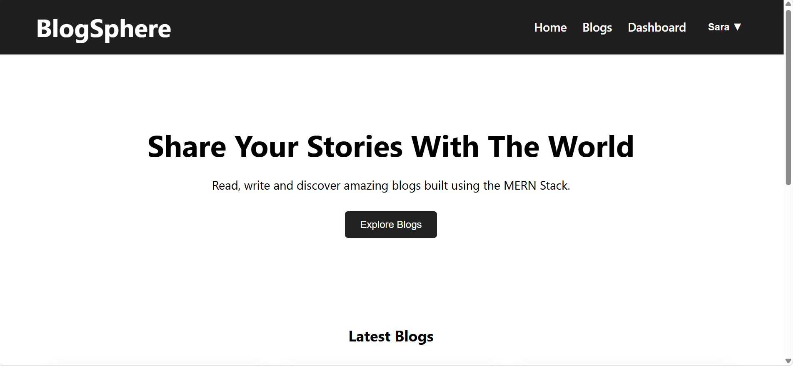
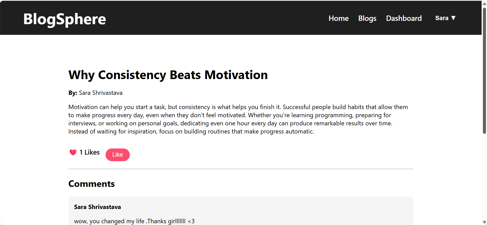

# 📝 BlogSphere
BlogSphere is a full-stack blogging platform that allows users to create, manage, and interact with blog content.

The application provides authentication, blog management, comments, likes, and a personalized dashboard where users can manage their published blogs.

## Features

## User Authentication
  User registration and login
  Secure user authentication
  Protected routes for authorized users
  User session management

## Blog Management
  Create new blogs
  View all blogs
  View detailed blog pages
  Edit existing blogs
  Delete blogs
  Personal dashboard for managing blogs

## Interactive Features
  Like blogs
  Add comments
  View comments on blog details page

## Dashboard
  View your published blogs
  Edit and delete your blogs
  Empty state UI when no blogs are created

## UI Features
  Responsive navigation bar
  User dropdown menu
  Blog cards
  Loading component
  Clean and modern interface

## Tech Stack
  Frontend
    React.js
    React Router DOM
    Axios
    CSS
  Backend
    Node.js
    Express.js
  Database
    MongoDB
    Mongoose
  Authentication
    JWT Authentication

## Project Structure
BlogSphere
│
├── backend
│   ├── controllers
│   ├── models
│   ├── routes
│   ├── server.js
│   └── .env
│
├── frontend
│   ├── src
│   │   ├── components
│   │   ├── pages
│   │   ├── App.js
│   │   └── index.js
│   │
│   └── package.json
│
└── README.md

## Installation

```bash
git clone <repository-url>
cd <project-folder>
npm install
npm start
```
##  Screenshots

###  Home Page



###  Blog Page


###  Blog Details



###  Dashboard


###  Login Page


###  Register Page


## Future Improvements

  Add image upload for blogs
  Add search and filtering
  Add categories and tags 
  Implement user profiles

## Author

  Sara Shrivastava
  B.Tech Information Technology